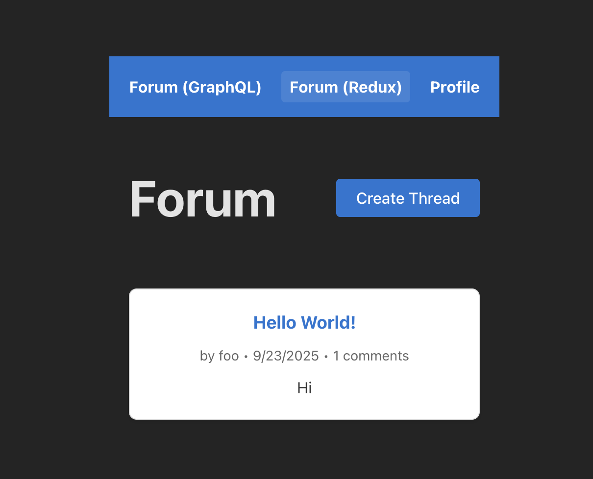

# SPA Demo: GraphQL vs REST Comparison

A full-stack forum application showcasing two different approaches to building modern web applications: **GraphQL + Apollo Client** vs **REST + Redux Toolkit Query**. This project serves as a practical comparison of these popular data fetching patterns.

## 🎯 Project Overview

This is an educational project that implements the same forum functionality using two different architectural approaches, allowing developers to compare and contrast:

- **Frontend**: React TypeScript application with dual implementations
- **Backend**: Ruby Sinatra server providing both GraphQL and REST APIs
- **Database**: PostgreSQL with optimized queries using DataLoaders
- **Authentication**: Session-based auth with secure cookie management



*The forum application showing both GraphQL and Redux implementations side-by-side*

## 🚀 Quick Start

### Prerequisites

- Node.js 20+ and npm
- Ruby 3.4.4 and Bundler
- PostgreSQL 13+
- Docker (optional, for database)

### Setup

1. **Clone the repository**:
```bash
git clone <repository-url>
cd spa-demo
```

2. **Database Setup** (Docker recommended):
```bash
cd server
docker-compose up -d
```

3. **Start the Backend**:
```bash
cd server
bundle install
bundle exec ruby server.rb
# Server runs on http://localhost:4567
# Database tables are automatically created on startup
```

4. **Start the Frontend**:
```bash
cd client
npm install
npm run dev
# Client runs on http://localhost:5173
```

5. **Access the Application**:
   - Visit `http://localhost:5173`
   - Create an account or login
   - Navigate between GraphQL and Redux implementations

## 🏗️ Architecture Overview

### System Architecture

```
┌─────────────────┐    ┌──────────────────┐    ┌──────────────────┐
│                 │    │                  │    │                  │
│   React Client  │───▶│   Sinatra API    │───▶│   PostgreSQL     │
│                 │    │                  │    │                  │
│ ┌─────────────┐ │    │ ┌──────────────┐ │    │ ┌──────────────┐ │
│ │   GraphQL   │ │───▶│ │   GraphQL    │ │    │ │    Users     │ │
│ │   Apollo    │ │    │ │   Schema     │ │    │ │   Threads    │ │
│ └─────────────┘ │    │ └──────────────┘ │    │ │   Comments   │ │
│                 │    │                  │    │ │    Likes     │ │
│ ┌─────────────┐ │    │ ┌──────────────┐ │    │ └──────────────┘ │
│ │    REST     │ │───▶│ │   REST API   │ │    │                  │
│ │  RTK Query  │ │    │ │  Endpoints   │ │    │                  │
│ └─────────────┘ │    │ └──────────────┘ │    │                  │
└─────────────────┘    └──────────────────┘    └──────────────────┘
```

### Data Flow Comparison

**GraphQL Approach**:
```
Component → useQuery/useMutation → Apollo Client → GraphQL Endpoint → DataLoader → Database
```

**REST Approach**:
```
Component → RTK Query Hook → Redux Store → REST Endpoint → Database Query → JSON Response
```

## 📊 Implementation Comparison

### GraphQL + Apollo Client

**Location**: `/forum` routes, `apollo/` directory

**Key Features**:
- Single `/graphql` endpoint for all operations
- Declarative data fetching with `useQuery` and `useMutation`
- Automatic query deduplication and intelligent caching
- N+1 query optimization with DataLoaders
- Type-safe operations with GraphQL schema

**Example Usage**:
```typescript
// GraphQL query
const { data, loading, error } = useQuery(GET_THREADS)

// GraphQL mutation with cache update
const [createThread] = useMutation(CREATE_THREAD, {
  refetchQueries: [{ query: GET_THREADS }]
})
```

### REST + Redux Toolkit Query

**Location**: `/forum_redux` routes, `store/forumApi.ts`

**Key Features**:
- RESTful `/api/*` endpoints following HTTP conventions
- RTK Query for declarative data fetching (Apollo-like experience)
- Tag-based cache invalidation system
- Generated TypeScript hooks for each endpoint
- Redux DevTools integration for debugging

**Example Usage**:
```typescript
// REST query
const { data, isLoading, error } = useGetThreadsQuery()

// REST mutation with automatic cache invalidation
const [createThread] = useCreateThreadMutation()
```

## 🎨 Feature Set

Both implementations provide identical functionality:

### Core Features
- ✅ **User Authentication**: Session-based login/logout
- ✅ **Thread Management**: Create, view, and list forum threads
- ✅ **Comments System**: Post comments on threads
- ✅ **Like System**: Like/unlike comments with real-time counts
- ✅ **User Profiles**: View user information and logout

### Advanced Features
- ✅ **Optimistic Updates**: Immediate UI feedback
- ✅ **Real-time Cache Updates**: Automatic data synchronization
- ✅ **Error Handling**: Comprehensive error states and messages
- ✅ **Loading States**: Proper loading indicators
- ✅ **Type Safety**: End-to-end TypeScript coverage

## 📁 Project Structure

```
spa-demo/
├── README.md                 # This file
├── client/                   # React TypeScript frontend
│   ├── README.md
│   ├── src/
│   │   ├── components/
│   │   │   ├── ForumRedux/   # Redux implementation
│   │   │   ├── ForumPage.tsx # GraphQL implementation
│   │   │   └── ThreadPage.tsx
│   │   ├── apollo/           # GraphQL configuration
│   │   ├── store/            # Redux configuration
│   │   └── App.tsx
│   ├── package.json
│   └── vite.config.ts
└── server/                   # Ruby Sinatra backend
    ├── README.md
    ├── app.rb                # Main server application
    ├── graphql_schema.rb     # GraphQL types and resolvers
    ├── loaders.rb            # DataLoader implementations
    ├── Gemfile
    └── docker-compose.yml
```

## 🔧 Technical Deep Dive

### Backend Architecture

**GraphQL Implementation**:
- Ruby GraphQL gem with custom type definitions
- DataLoader pattern for N+1 query optimization
- Batch loading with `GraphQL::Dataloader::Source`
- Complex nested resolvers with efficient data fetching

**REST Implementation**:
- Traditional HTTP methods (GET, POST, PUT, DELETE)
- JSON responses with consistent error handling
- Optimized SQL queries with JOINs for related data
- RESTful resource naming conventions

### Frontend Architecture

**State Management**:
- **GraphQL**: Apollo Client cache as single source of truth
- **REST**: Redux Toolkit for client state + RTK Query for server state

**Data Fetching**:
- **GraphQL**: Declarative queries with automatic caching
- **REST**: Hook-based API calls with tag-based invalidation

**Performance**:
- Both implementations use optimistic updates
- Intelligent caching reduces unnecessary network requests
- TypeScript prevents runtime errors

## 🎓 Learning Objectives

This project helps developers understand:

### 1. **Data Fetching Patterns**
- Compare declarative (GraphQL) vs imperative (REST) approaches
- Understand when each approach is most suitable
- Learn about caching strategies and optimization

### 2. **State Management**
- Apollo Client vs Redux for application state
- Server state vs client state separation
- Cache invalidation and data synchronization

### 3. **API Design**
- GraphQL schema design and resolver patterns
- RESTful API design and resource modeling
- Error handling and validation strategies

### 4. **Performance Optimization**
- N+1 query problems and solutions
- Client-side caching strategies
- Optimistic updates and user experience

### 5. **Developer Experience**
- Tooling differences (Apollo DevTools vs Redux DevTools)
- Type safety approaches and benefits
- Debugging and development workflows

## 🔍 When to Choose Each Approach

### Choose GraphQL When:
- ✅ Frontend needs vary significantly in data requirements
- ✅ Multiple client applications consume the API
- ✅ Strong typing and schema evolution are priorities
- ✅ Team has GraphQL expertise
- ✅ Real-time features are important

### Choose REST When:
- ✅ Team is familiar with HTTP/REST conventions
- ✅ Simple CRUD operations dominate
- ✅ HTTP caching is important
- ✅ Integration with existing REST services
- ✅ Gradual adoption is preferred

## 📈 Performance Metrics

Both implementations are optimized for performance:

### GraphQL Benefits:
- **Single Request**: Get all needed data in one query
- **No Over-fetching**: Request only required fields
- **Automatic Batching**: DataLoaders prevent N+1 queries
- **Intelligent Caching**: Normalized cache with automatic updates

### REST Benefits:
- **HTTP Caching**: Standard caching headers and ETags
- **Simple Debugging**: Easy to test with curl/Postman
- **Incremental Loading**: Load data as needed
- **Predictable**: Well-understood patterns and conventions

## 🛠️ Development Workflow

### Adding New Features

1. **Database Changes**: Update schema in `server/app.rb`
2. **GraphQL**: Add types to `graphql_schema.rb`, update DataLoaders
3. **REST**: Add endpoints to `app.rb`, update API documentation
4. **Frontend**: Implement in both GraphQL and Redux versions
5. **Testing**: Verify both implementations work identically

### Debugging Tips

- **Apollo DevTools**: Inspect GraphQL queries and cache
- **Redux DevTools**: Monitor state changes and API calls
- **Network Tab**: Compare request patterns between approaches
- **PostgreSQL Logs**: Monitor database query performance

## 🚀 Deployment

### Production Considerations

**Security**:
- Enable HTTPS and secure cookie settings
- Implement proper CORS policies
- Use environment variables for secrets
- Add rate limiting and authentication middleware

**Performance**:
- Implement PostgreSQL connection pooling
- Add Redis for session storage and caching
- Configure CDN for static assets
- Monitor application performance

**Scalability**:
- Horizontal scaling with load balancers
- Database read replicas for query optimization
- Microservices architecture for larger applications

## 🤝 Contributing

This is an educational project! Contributions are welcome:

1. **Feature Additions**: Implement new forum features in both approaches
2. **Performance Optimizations**: Improve query efficiency or caching
3. **Documentation**: Enhance examples and explanations
4. **Testing**: Add comprehensive test suites
5. **Deployment**: Create Docker configurations or deployment scripts

## 📚 Additional Resources

### GraphQL Resources:
- [GraphQL Ruby Documentation](https://graphql-ruby.org/)
- [Apollo Client Documentation](https://www.apollographql.com/docs/react/)
- [GraphQL Best Practices](https://graphql.org/learn/best-practices/)

### REST Resources:
- [Redux Toolkit Query Documentation](https://redux-toolkit.js.org/rtk-query/overview)
- [RESTful API Design Best Practices](https://restfulapi.net/)
- [HTTP Status Codes Reference](https://httpstatuses.com/)

### Database Resources:
- [PostgreSQL Documentation](https://www.postgresql.org/docs/)
- [Database Design Best Practices](https://www.databasestar.com/database-design-best-practices/)

## 📄 License

This project is for educational purposes. Feel free to use, modify, and learn from the code.

---

**Happy Learning!** 🎉

Compare the two approaches, experiment with the code, and discover which pattern works best for your use cases.
